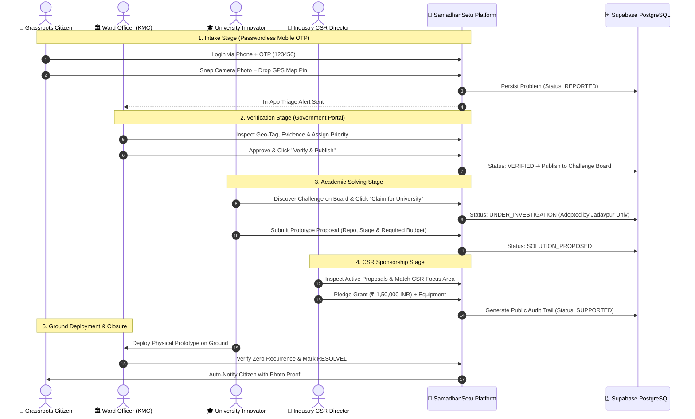
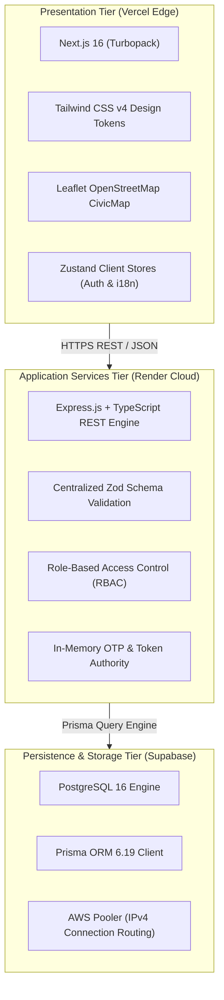

# 🌉 SamadhanSetu (समाधान सेतु)
### *A Multi-Sided Civic Innovation Engine Bridging Grassroots Citizens, Government, Academia & Corporate CSR*

**Official Platform Showcase & Executive Deck** &middot; *Version 2.0 (Enhanced Visual Edition)*

---

```
┌───────────────────────────────────────────────────────────────────────────────────────────────────────┐
│                                     🏆 LIVE PRODUCTION DEPLOYMENT                                      │
├───────────────────────────────────┬───────────────────────────────────┬───────────────────────────────┤
│ 🌐 WEB APPLICATION (Vercel)       │ ⚡ API ENGINE (Render Container)  │ 🗄️ DATABASE (Supabase)        │
│ https://frontend-tpit.vercel.app  │ samadhansetu-tpub.onrender.com    │ PostgreSQL 16 (AWS Pooler)    │
└───────────────────────────────────┴───────────────────────────────────┴───────────────────────────────┘
```

<br/>

## 📊 Live Platform Impact Metrics (At a Glance)

```
┌─────────────────────────┐  ┌─────────────────────────┐  ┌─────────────────────────┐  ┌─────────────────────────┐
│   ₹ 3,50,000 INR        │  │       4 CHALLENGES      │  │      2 UNIVERSITIES     │  │       100% AUDIT        │
│   CSR Capital Committed │  │    Verified Pilot Issues│  │  Jadavpur & IIEST Shibpur│  │  Transparent Lifecycles │
│   🟢 100% Traceable     │  │    📍 Kolkata Urban Area│  │   🔬 Student Lab Capston│  │  📋 Immutable Event Log│
└─────────────────────────┘  └─────────────────────────┘  └─────────────────────────┘  └─────────────────────────┘

---

## 🎬 Platform Presentation Carousel: The Complete Story

````carousel
### Slide 1: The Broken Civic Redressal Reality Today
```
                       THE BLACK-HOLE CYCLE OF CIVIC REDRESSAL
                       
 ┌──────────────────────┐         ┌──────────────────────┐         ┌──────────────────────┐
 │ 👤 Grassroots Citizen│         │ 🏛️ Overworked Govt   │         │ 🎓 Student Innovator │
 │ Files pothole report │ ─────▶  │ Complaint sits queued│ ───X───  │ Builds toy projects  │
 │ on standard portal.  │         │ due to budget crunch.│         │ for college grades.  │
 └──────────────────────┘         └──────────────────────┘         └──────────────────────┘
            │                                                                 │
            ▼                                                                 ▼
 ❌ No tracking, no feedback      ❌ Same pothole breaks every monsoon     ❌ Zero ground impact
```

> [!WARNING]
> **The Trillion-Rupee Paradox**: Over **₹ 28,000 Crores** of mandatory CSR funding in India is spent annually, while millions of engineering students build simulated, discardable capstone projects. Meanwhile, municipal corporations struggle to find technological solutions for chronic water leaks, road subsidence, and garbage overflow.
<!-- slide -->
### Slide 2: The SamadhanSetu Transformation (The 4-Sided Bridge)
```
                                        🏛️ GOVERNMENT
                                    (Triage & Authentication)
                                                │
                                                │ Verified & Published
                                                ▼
         👤 CITIZEN ─────────────▶ [ 🌉 SAMADHANSETU ] ◀───────────── 💼 INDUSTRY CSR
     (GPS Pin & Camera Proof)              ▲                     (Capital & Mentorship)
                                           │
                                           │ Claims & Builds
                                           │
                                     🎓 UNIVERSITIES
                                  (Engineering Solvers)
```

> [!TIP]
> **Key Innovation**: When an issue is verified by the municipal authority, it **does not wait in a queue for tax funds**; it becomes a sponsored innovation challenge claimed by student engineering labs and funded directly by corporate CSR grants.
<!-- slide -->
### Slide 3: The 5-Stage "Setu" Problem-to-Solution Path
```
  [ STAGE 1 ]            [ STAGE 2 ]            [ STAGE 3 ]            [ STAGE 4 ]            [ STAGE 5 ]
  
 ┌────────────┐         ┌────────────┐         ┌────────────┐         ┌────────────┐         ┌────────────┐
 │  REPORTED  │ ──────▶ │  VERIFIED  │ ──────▶ │   CLAIMED  │ ──────▶ │  SUPPORTED │ ──────▶ │  RESOLVED  │
 └────────────┘         └────────────┘         └────────────┘         └────────────┘         └────────────┘
       │                      │                      │                      │                      │
  Citizen snaps          Ward Engineer          University lab         CSR Foundation         Ground fix
  camera photo +         inspects site &        claims problem         pledges grant &        tested, clamped
  GPS map pin            approves challenge     for prototyping        testing hardware       & public closed
```

> [!NOTE]
> Every transition generates an **immutable timeline event** visible on the public challenge board with exact timestamps, stakeholder names, and funding records.
<!-- slide -->
### Slide 4: Real Pilot Showcase — Kolkata Municipal Corporation (KMC)
```
┌─────────────────────────────────────────────────────────────────────────────────────────────────┐
│ 📍 Kolkata Pilot Showcase: Pothole & Road Subsidence on Park Street Junction                    │
├─────────────────────────────────────────────────────────────────────────────────────────────────┤
│ • Status: SOLUTION_PROPOSED (Stage: PROTOTYPE)                                                  │
│ • Reporter: Ramesh Kumar (Citizen, Ward 63)                                                     │
│ • Triage Officer: Officer Rajesh Patil (Executive Engineer, KMC Borough V)                     │
│ • Solver Team: Dr. Anita Kulkarni & Civil Dept (Jadavpur University)                            │
│ • Proposed Fix: Cold-mix rapid geopolymer overlay (45-min cure in monsoon)                      │
│ • CSR Sponsor: Tata Trusts Urban Innovation Grant — ₹ 1,50,000 Committed                       │
│ • Setu Timeline: 5 Milestones Logged & Publicly Verifiable                                      │
└─────────────────────────────────────────────────────────────────────────────────────────────────┘
```
````

---

## 🔄 End-to-End Stakeholder Lifecycle Sequence

This sequence diagram illustrates how all four stakeholder personas interact through the live platform:



---

## 🖥️ Platform User Experience (Live UI Architecture)

```
┌───────────────────────────────────────────────────────────────────────────────────────────────────────┐
│ 👤 CITIZEN MOBILE INTAKE                     │ 🏛️ GOVERNMENT TRIAGE CONSOLE                           │
├──────────────────────────────────────────────┼────────────────────────────────────────────────────────┤
│ ┌──────────────────────────────────────────┐ │ ┌────────────────────────────────────────────────────┐ │
│ │ 📍 Pin Location (Park Street, Ward 63)   │ │ │ 📋 Pending Verification Queue (12)                 │ │
│ │ 📷 Camera Evidence: [Live Pothole.jpg]   │ │ │ • Pothole on Park Street   [High]  [Review ➔]     │ │
│ │ 🏷️ Category: Roads & Infrastructure      │ │ │ • Water Leak at Gariahat   [Urgent][Review ➔]     │ │
│ │ 🔘 [ Submit Grievance (OTP Verified) ]   │ │ │ • Koley Market Waste Mounds[Med]   [Review ➔]     │ │
│ └──────────────────────────────────────────┘ │ └────────────────────────────────────────────────────┘ │
├──────────────────────────────────────────────┼────────────────────────────────────────────────────────┤
│ 🎓 UNIVERSITY PROTOTYPING PORTAL             │ 💼 CORPORATE CSR SPONSORSHIP DESK                      │
├──────────────────────────────────────────────┼────────────────────────────────────────────────────────┤
│ ┌──────────────────────────────────────────┐ │ ┌────────────────────────────────────────────────────┐ │
│ │ 🔬 Active Capstone Proposals (3)         │ │ │ 💰 CSR Grant Commitment Portfolio                  │ │
│ │ • Cold-Mix Geopolymer Asphalt Overlay    │ │ │ • Tata Trusts: ₹ 1,50,000 ➔ Park St Solution       │ │
│ │ • Acoustic Pipe Leak Sensor Network      │ │ │ • Infosys Foundation: ₹ 2,00,000 ➔ Water Network   │ │
│ │ 🔗 [ View GitHub Repo & CAD Blueprints ] │ │ │ 📑 [ Download 100% Tax Audit Trail Receipt ]       │ │
│ └──────────────────────────────────────────┘ │ └────────────────────────────────────────────────────┘ │
└───────────────────────────────────────────────────────────────────────────────────────────────────────┘
```

---

## 🏆 Competitive Differentiation Matrix

```
                             [ High Ground Collaboration ]
                                           ▲
                                           │
                                           │          ★ SamadhanSetu
                                           │    (Multi-Sided Platform)
                                           │    • Real Municipal Testbeds
                                           │    • Private CSR Grant Pool
                                           │    • Transparent 5-Stage Audit
                                           │
      [ Grievance-Only ] ──────────────────┼────────────────── [ Hackathon-Only ]
       CPGRAMS / Swachhata                 │               Smart India Hackathon
     • Closed bureaucracy                  │               • Prototypes never deployed
     • Complaints sit unresolved           │               • Abandoned after prize day
     • Zero academic involvement           │               • No municipal adoption
                                           │
                                           │
                                           ▼
                                 [ Siloed & Disconnected ]
```

| Dimension | Traditional Grievance Apps (Swachhata, CPGRAMS) | Student Competitions (SIH, College Hackathons) | 🌉 SamadhanSetu (Our Platform) |
| :--- | :---: | :---: | :---: |
| **Problem Origin** | Grassroots Citizen | Artificial / Hypothetical | **Real Grassroots Geotagged Issues** 🟢 |
| **Solving Capability** | Government Staff Only (Capacity Capped) | Students Only (Isolated) | **Academic Research Labs + Mentors** 🟢 |
| **Funding Mechanism** | Municipal Budget (Often Depleted) | Fixed Prize Money Only | **Corporate CSR Micro-Grants** 🟢 |
| **Tracking Model** | Internal Ticket Number | None Post-Event | **Public 5-Stage Immutable Timeline** 🟢 |
| **Ground Deployment** | Often Delayed | Less than 3% deployed | **Mandatory Pilot Deployment before Resolution** 🟢 |
| **Accessibility** | English-Centric forms | Technical jargon | **Bilingual (English + हिंदी) + Camera Snapping** 🟢 |

---

## 🏛️ Comprehensive Alignment with United Nations SDGs

```
┌─────────────────────────────────┬─────────────────────────────────┬─────────────────────────────────┐
│            SDG 11               │             SDG 9               │             SDG 17              │
│ 🏙️ SUSTAINABLE CITIES          │ 🏗️ INNOVATION & INFRASTRUCTURE  │ 🤝 PARTNERSHIPS FOR GOALS       │
├─────────────────────────────────┼─────────────────────────────────┼─────────────────────────────────┤
│ Eliminates chronic open waste   │ Bridges academic engineering    │ Unites Government, Higher Ed,   │
│ dumps and detects dangerous road│ research directly with ground   │ Corporate CSR & Citizens into   │
│ subsidence before fatal skids.  │ infrastructure testing.         │ one transparent ecosystem.      │
└─────────────────────────────────┴─────────────────────────────────┴─────────────────────────────────┘
```

---

## 🛠️ Production Architecture & Technology Stack



---

## 🔑 Demonstration Credentials Matrix

You can test every single stakeholder persona right now on the live web application:

| Persona | Login Method | Identifier | Credentials | Assigned Production Workspace |
| :--- | :--- | :--- | :--- | :--- |
| **👤 Grassroots Citizen** | Mobile OTP | `9876543210` | Demo OTP: `123456` | [`/dashboard/citizen`](https://frontend-tpit.vercel.app/dashboard/citizen) |
| **🏛️ Municipal Officer** | Email & Password | `officer.patil@kmc.gov.in` | `Password@123` | [`/dashboard/government`](https://frontend-tpit.vercel.app/dashboard/government) |
| **🎓 University Innovator** | Email & Password | `anita.kulkarni@jadavpuruniversity.in` | `Password@123` | [`/dashboard/university`](https://frontend-tpit.vercel.app/dashboard/university) |
| **💼 Industry CSR Director** | Email & Password | `csr.mehta@tatatrusts.org` | `Password@123` | [`/dashboard/industry`](https://frontend-tpit.vercel.app/dashboard/industry) |
| **🌐 Public Challenge Board**| *No Login Needed* | Public Access | Free Browsing | [`/challenge`](https://frontend-tpit.vercel.app/challenge) |
| **📈 Global Impact Analytics**| *No Login Needed* | Public Access | Free Browsing | [`/analytics`](https://frontend-tpit.vercel.app/analytics) |

---

*SamadhanSetu (समाधान सेतु) &middot; Empowering Grassroots Communities Through Collaborative Engineering &middot; Built with ❤️ for India's Smart Cities.*
