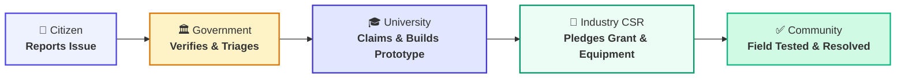
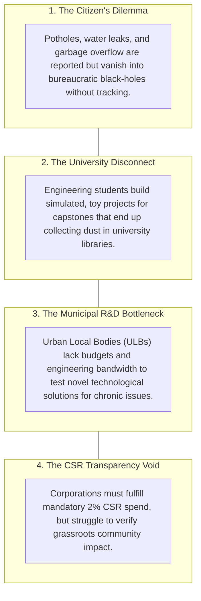
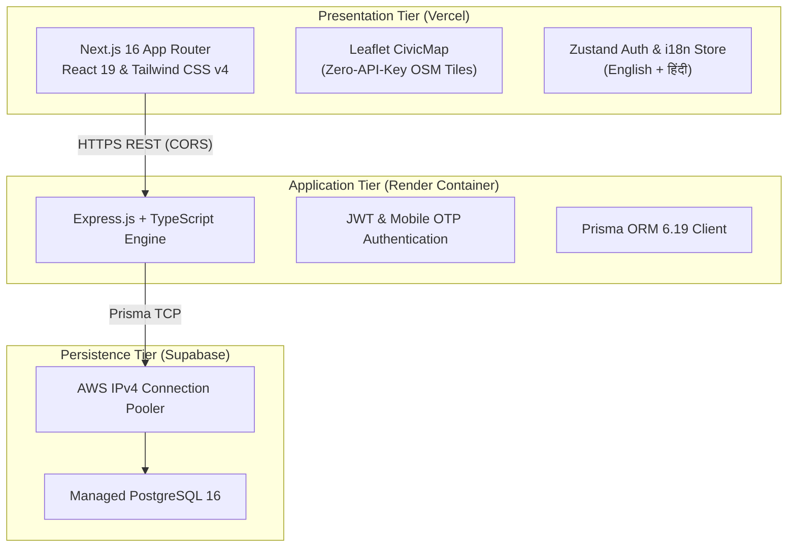

# 🌉 SamadhanSetu (समाधान सेतु)
### *Bridging Grassroots Civic Challenges with Academic Innovation & Corporate CSR*

**Executive Pitch Deck & Platform Summary**  
*Official Version 1.0 &middot; September 2026*

---

> [!NOTE]
> **Live Production Platform**:
> - 🌐 **Web Application (Vercel):** [https://frontend-tpit.vercel.app](https://frontend-tpit.vercel.app)
> - ⚡ **API Engine (Render):** [https://samadhansetu-tpub.onrender.com](https://samadhansetu-tpub.onrender.com)
> - 🗄️ **Database (Supabase PostgreSQL):** `aws-0-ap-south-1.pooler.supabase.com:5432/postgres`
> - 🐙 **Source Code (GitHub):** [https://github.com/Shafi0903/SamadhanSetu](https://github.com/Shafi0903/SamadhanSetu)

---

## 1. Executive Summary

**SamadhanSetu** (समाधान सेतु — *"The Bridge of Solutions"*) is a next-generation multi-sided civic innovation platform that transforms municipal grievance redressal from a static complaint register into a **collaborative problem-solving engine**.

While conventional grievance portals end when a citizen files a complaint, SamadhanSetu links **Citizens**, **Municipal Authorities**, **Engineering Universities**, and **Corporate CSR Partners** into a transparent, 5-stage lifecycle that turns verified urban issues into student capstone challenges backed by corporate grants.



---

## 2. The Problem: The Broken Civic Innovation Loop

Urban centers in developing economies suffer from four disconnected realities:



| Stakeholder | Current Frustration | The SamadhanSetu Remedy |
| :--- | :--- | :--- |
| **Citizens** | Unheard voices, lack of follow-up | One-click GPS pinning, camera upload, live timeline |
| **Governments** | Overwhelmed staff, repeat complaints | Crowdsourced R&D, verified triage console |
| **Universities** | Theoretical curricula, unimpactful projects | Real municipal problem statements, field test sites |
| **Industry CSR** | Blind donations, opaque impact reporting | Direct micro-grants to validated student solutions |

---

## 3. The 4 Stakeholder Personas & Value Proposition

### 👤 1. Grassroots Citizens (The Reporters)
- **Zero-Barrier Access**: Passwordless mobile OTP login; bilingual interface (English + Hindi / हिंदी).
- **Rich Intake**: Smartphone camera evidence upload with auto-compression, interactive Leaflet map pin with auto-lat/lng detection.
- **Neighborhood Upvoting**: Vote on local issues to raise priority for ward officers.

### 🏛️ 2. Nodal Municipal Authorities (The Verifiers)
- **Triage Console**: Review incoming grievances, assign priority (*LOW, MEDIUM, HIGH, URGENT*), inspect photographic evidence.
- **Authenticity Gatekeeping**: Reject frivolous complaints with official notes or verify and publish to the public **Challenge Board**.
- **Ward-Level Oversight**: Real-time resolution metrics across municipal wards.

### 🎓 3. University Innovators & Faculty (The Solvers)
- **Challenge Claiming**: Faculty and students claim verified challenges for academic hackathons, capstones, and thesis work.
- **Prototype Submission**: Submit technical proposals with prototype stage (*PROPOSED ➔ PROTOTYPE ➔ TESTING ➔ DEPLOYED*), documentation, and GitHub repository links.
- **Field Deployments**: Access municipal test sites to pilot physical sensors, asphalt mixes, or waste treatment devices.

### 💼 4. Industry & CSR Foundations (The Enablers)
- **Targeted Sponsorship**: Browse student proposals and pledge CSR micro-grants (in INR), laboratory hardware, or executive mentorship.
- **Audit-Ready Compliance**: Every rupee pledged generates an immutable event on the public Setu audit trail.

---

## 4. The 5-Stage "Setu" Problem-to-Solution Path

Every challenge moves through five auditable states:

```
  [1] REPORTED ──▶ [2] VERIFIED ──▶ [3] CLAIMED ──▶ [4] SUPPORTED ──▶ [5] RESOLVED
       │                │                │                 │                │
  Citizen logs     Authority        University        Corporate CSR     Tested on
   GPS pin +      triages and       adopts for        commits grant    ground, closed
   photo proof     publishes        prototyping       or equipment      with community
```

1. **REPORTED**: Citizen logs grievance with location coordinates and photo proof.
2. **VERIFIED**: Municipal engineer visits/validates site conditions and publishes problem to public board.
3. **CLAIMED**: Engineering department officially claims challenge for academic problem-solving.
4. **SUPPORTED**: Corporate sponsor pledges financial or equipment resources directly to the proposal.
5. **RESOLVED**: Solution is deployed on the ground, pressure/leak/pothole fixed, and closed on the public registry.

---

## 5. Technical Architecture & System Design

SamadhanSetu is built on a modern, modular monorepo stack:



### Production Technology Highlights:
- **Frontend**: Next.js 16 (Turbopack), React 19, Tailwind CSS v4, Lucide & Heroicons.
- **Backend**: Node.js 22, Express, TypeScript, Zod request schema validation.
- **Database**: PostgreSQL 16 hosted on Supabase (Mumbai `ap-south-1` region), Prisma ORM with migrations and seeds.
- **DevOps**: Multi-stage Docker build containers, GitHub Actions automated CI workflow, root `docker-compose.yml`.

---

## 6. Live Pilot Showcase: Pune Municipal Corporation (PMC)

The platform is pre-loaded with realistic pilot challenges, academic teams, and corporate partners:

```
├── Pune Municipal Corporation (Ward 4 Executive Engineer)
│   ├── Issue 1: Severe Monsoon Potholes & Road Subsidence on FC Road Junction
│   │   ├── Status: SOLUTION_PROPOSED (Stage: PROTOTYPE)
│   │   ├── Solver: Dr. Anita Kulkarni (COEP Technological University)
│   │   └── CSR Sponsor: Tata Trusts (₹ 1,50,000 Pledged)
│   ├── Issue 2: Garbage Overflow & Waste Segregation at Market Yard Gate 3
│   │   ├── Status: VERIFIED (Open for University Solving)
│   │   └── Reporter: Ramesh Kumar (Citizen)
│   └── Issue 3: High-Volume Clean Water Pipeline Leakage at Kothrud Junction
│       ├── Status: RESOLVED
│       ├── Solver: Prof. Vikram Rao (IIT Bombay IoT Lab)
│       └── Deployed Solution: Acoustic IoT Pressure Clamping
```

---

## 7. United Nations Sustainable Development Goals (SDG) Alignment

| UN SDG | Goal Target | SamadhanSetu Contribution |
| :---: | :--- | :--- |
| **SDG 11** | **Sustainable Cities and Communities** | Empowers citizens to protect public infrastructure, eliminate open dump sites, and safeguard urban resilience. |
| **SDG 9** | **Industry, Innovation & Infrastructure** | Channels academic research capacity and private CSR funding into real urban infrastructure renewal. |
| **SDG 6** | **Clean Water and Sanitation** | Rapid crowdsourced detection of municipal pipeline bursts and water contamination hotspots. |
| **SDG 17** | **Partnerships for the Goals** | Creates a formal multi-sided bridge linking government, universities, corporates, and civil society. |

---

## 8. Competitive Differentiation

```
                             [ High Collaboration ]
                                       ▲
                                       │
                                       │       ★ SamadhanSetu
                                       │    (Multi-Sided Civic Tech)
                                       │
      [ Grievance-Only ] ──────────────┼────────────── [ Innovation-Only ]
       CPGRAMS / Swachhata             │          Smart India Hackathon
     (Complaints disappear)            │       (Prototypes never deployed)
                                       │
                                       │
                                       ▼
                             [ Opaque & Siloed ]
```

- **Versus Government Grievance Portals (e.g. Swachhata / CPGRAMS)**:
  Traditional portals only log complaints. When municipal budgets run out, the issue sits unresolved. SamadhanSetu brings universities and CSR funding to actively build the fix.
- **Versus Student Hackathons (e.g. Smart India Hackathon)**:
  Traditional hackathons build prototypes that are forgotten after prize day. SamadhanSetu connects winners to municipal test-beds and ongoing CSR maintenance grants.

---

## 9. Future Expansion Roadmap

1. **Municipal Ward Geo-Fencing**: Automatic polygon boundary matching to route grievances to ward engineers by GPS.
2. **WhatsApp Civic Intake Bot**: Citizens submit photo + location directly via WhatsApp without opening a web browser.
3. **Voice-to-Text Civic Reporting (Bhashini)**: Regional spoken intake (Marathi, Tamil, Bengali) for illiterate citizens.
4. **SLA Escalation Engine**: Automated alerts to the Municipal Commissioner when an issue is not triaged within 48 hours.

---

## 10. Live Platform Credentials (Demo Access)

| Role | Login Identifier | Credentials | Assigned Dashboard |
| :--- | :--- | :--- | :--- |
| **Citizen** | Phone: `9876543210` | Demo OTP: `123456` | [`/dashboard/citizen`](https://frontend-tpit.vercel.app/dashboard/citizen) |
| **Government** | `officer.patil@pmc.gov.in` | `Password@123` | [`/dashboard/government`](https://frontend-tpit.vercel.app/dashboard/government) |
| **University** | `anita.kulkarni@coep.ac.in` | `Password@123` | [`/dashboard/university`](https://frontend-tpit.vercel.app/dashboard/university) |
| **Industry** | `csr.mehta@tatatrusts.org` | `Password@123` | [`/dashboard/industry`](https://frontend-tpit.vercel.app/dashboard/industry) |
| **Public Board** | *No Login Required* | *Public Access* | [`/challenge`](https://frontend-tpit.vercel.app/challenge) |
| **Global Analytics**| *No Login Required* | *Public Access* | [`/analytics`](https://frontend-tpit.vercel.app/analytics) |

---

*SamadhanSetu (समाधान सेतु) &middot; Empowering Grassroots Communities Through Collaborative Engineering &middot; Built with ❤️ for India's Smart Cities.*
